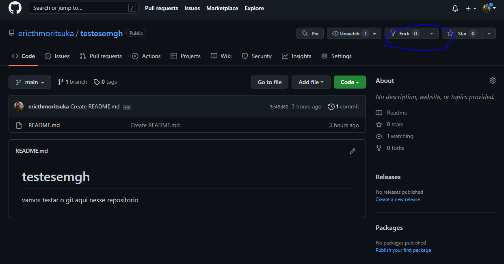
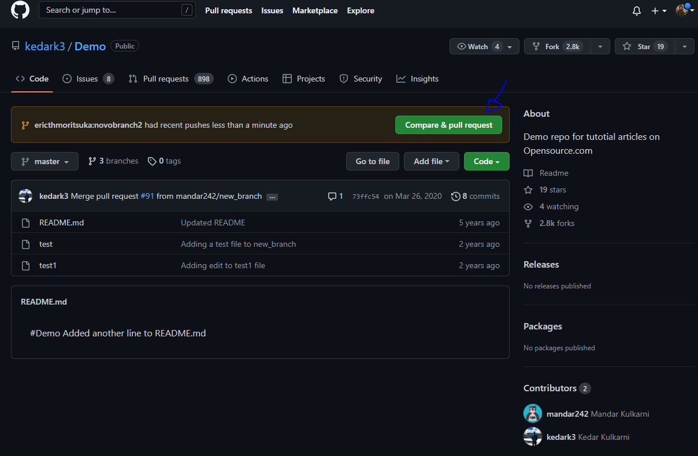

<h1>Eu fiz esses passos aqui</h1>
  <ol>
    <li>Entrar no link <a href="https://github.com/ericthmoritsuka/testesemgh">https://github.com/ericthmoritsuka/testesemgh</a></li>
    <li>
      Fazer um fork do repositorio
      
    </li>
    <li>
      Criar um clone fo repositorio na maquina:  
      git clone https://github.com/nomedousuariodevoces/nomequevocesderamprofork
    </li>
    <li>Aqui eu não entendi exatamente se tinha que dar um git init mas teve uma hora que eu fiz sem e ele disse que não era um repositório, então acabei colocando o comando.</li>
    <li>
      Criar um novo branch:  
      git checkout -b nomedobranch
    </li>
    <li>
      Criar um novo remote para o repositorio upstream (o original de onde fizemos o fork):  
      git remote add upstream https://github.com/ericthmoritsuka/testesemgh
    </li>
    <li>Fazer mudanças</li>
    <li>
      Checar se esta no mesmo pe que o repositorio upstream:  
      git status
    </li>
    <li>
      Adicionar as modificações:  
      git add nomedoarquivo 
      git add . (tudo) 
      git add -A (tudo)
    </li>
    <li>
      Fazer o commit:  
      git commit -m 'mensagem do commit' 
      Aqui o git pediu pra eu me identificar, nao sei se o cara do treinamento que eu vi que fez ou se o proprio git faz isso, imgino que seja o git 
      git config --global user.email emaildapessoa 
        git config --global user.name nomedousuario
      
    </li>
    <li>
      Fazer o push para o origin:  
      git push origin nomedobranch 
    </li>
    <li>
      Aparece esse botao no github:  
      
    </li>
    <li>
      Depois de clicar nele aparece essa tela onde da pra ver os commits, alteracoes feitas e comparacoes e onde da pra criar o pull request:  
      
    </li>
    <li>
      Depois disso eu não vi ainda. Mas o dono do repositório deve analisar o pull request pra ver se o merge vai acontecer ou não, deve ser isso...
    </li>
  </ol>
